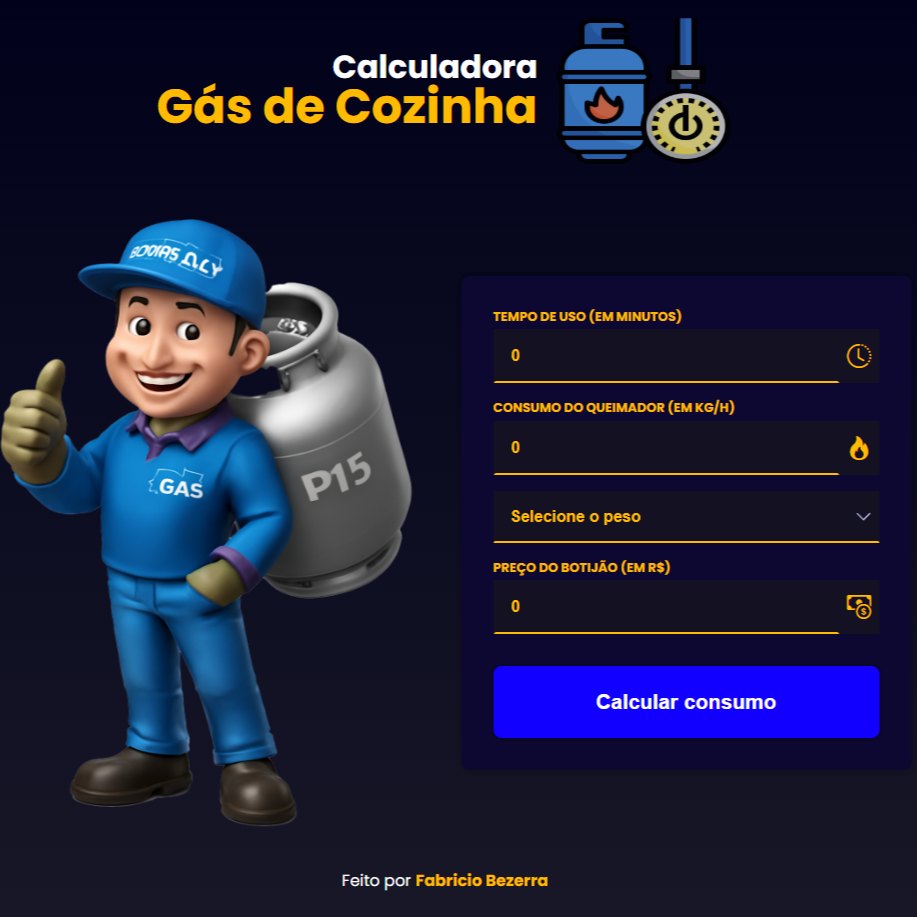

<h1 align="center"> Calculadora Gás de Cozinha 🗂️ </h1>

Projeto desenvolvido por <a href="https://github.com/fabriciobzrr" target="_blank">Fabricio Bezerra</a> com o propósito de criar uma calculadora que calcula o consumo de gás de cozinha através do tempo de uso do forno, do consumo do queimador do fogão, da capacidade e preço do botijão de gás.

  <a href="#-tecnologias">Tecnologias</a>&nbsp;&nbsp;&nbsp;|&nbsp;&nbsp;&nbsp;
  <a href="#-projeto">Projeto</a>&nbsp;&nbsp;&nbsp;|&nbsp;&nbsp;&nbsp;
  <a href="#-layout">Layout</a>&nbsp;&nbsp;&nbsp;|&nbsp;&nbsp;&nbsp;
  <a href="#-licença">Licença</a>

  

 

  

## 🤖 Tecnologias

Esse projeto foi desenvolvido com as seguintes tecnologias:

- HTML e CSS
- JavaScript
- Git e Github

## 🛠️ Projeto

A Calculadora de Gás de Cozinha é uma ferramenta interativa e moderna, projetada para ajudar os usuários a calcular o consumo de gás de forma rápida e eficiente. Este projeto não só resolve uma necessidade prática do dia a dia, como também é uma vitrine das minhas habilidades como desenvolvedor front-end. Ao construí-lo, apliquei as melhores práticas de desenvolvimento para garantir uma interface funcional, responsiva e agradável, consolidando o conhecimento que adquiri na minha jornada profissional.

## 📝 Layout

Você pode visualizar o layout do projeto através do link: [Layout Calculadora Gás de Cozinha](https://i.ibb.co/99NhvrKX/preview.png).

## 📄 Licença

Esse projeto está sob a licença MIT.

---

Desenvolvido por **Fabricio Bezerra**.  
Se desejar comentar o projeto ou propor colaborações, estou à disposição!

---

Obrigado por visitar — que este projeto inspire criatividade e evolução contínua.
